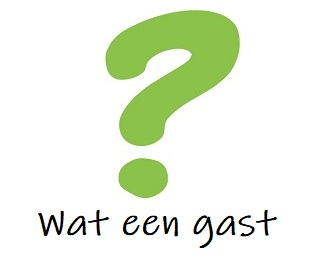

# Wat een gast - De app!
Welkom op de GitHub-repository voor de enige echte Wateengast-app van de wereld! 
Stay tuned voor meer awesomeheid dan je ooit hebt meegemaakt.

Uiteraard met alle fantastische onzin van https://www.wateengast.nl

Geef deze pagina een star/watch/fork als je als eerste op de hoogte wilt blijven van alle ontwikkelingen rond deze briljante app. Mijlpalen worden uiteraard onder luid gejuich op alle sociale media gepubliceerd.

Dan without further gedoe:

### Contents
<ol>
  <li>Hoe zit het in elkaar</li>
  <li>Welke techniek gebruik je?</li>
  <li>Hoe gaat dit in productie?</li>
  <li>Android en iOS</li>
  <li>Toekomstige features en wensen</li>
  <li>Huidige status</li>
</ol>

### Hoe zit het in elkaar?
Om een app te maken van mijn Wordpress-blog <a href="https://www.wateengast.nl">Wateengast.nl</a> heb ik de hulp ingeroepen van online trainingsplatform Udemy. Voor slechts €9,99 volg ik <a href="https://www.awin1.com/cread.php?awinmid=15928&awinaffid=532041&clickref=&p=%5B%5Bhttp%3A%2F%2Fv%5D%5D" target="_new">deze cursus</a> waarin een gortdroge stereotype IT-Indiër me stap voor stap richting een prachtige app codeert. Geweldig om mee te maken!

### Welke techniek gebruik je?
Deze app wordt ontwikkeld op basis van het Ionic framework voor app development. Dat framework zet een compleet template met bestanden voor je neer, en die kan je vervolgens met een code editor helemaal naar wens aanvullen. De code is vooral HTML, JavaScript en Angular. Het Ionic framework zorgt ervoor dat je allemaal standaard app elementen kunt inzetten zodat je tegelijkertijd een app voor Android en iOS (Apple) in elkaar kunt knutselen.

Zoals gezegd is mijn website een standaard Wordpress blog en met een JSON API plugin zorg ik dat ik de data van mijn posts de app in kan slurpen. Makkelijk zat! 

### Hoe gaat dit in productie?
Zover ben ik nog niet, maar als ik het goed begrijp komen er straks twee pakketjes uit waarmee ik bij de app stores aan kan kloppen.

### Android en iOS
In eerste instantie zal ik deze app op Android uit gaan brengen, puur vanwege het feit dat ik daar een groot fan van ben en dat vele malen makkelijker en goedkoper is dan die dichtgeknepen Apple-store. Daarbij is het verschil in prijs ook zeker niet misselijk! Om een Android app te kunnen publiceren betaal je eenmalig 29 dollar, terwijl Apple je jaarlijks(!) maar liefst 99 dollar vraagt. Absurd zeg, ze kunnen je net zo goed vragen om ook meteen je been op te sturen.

### Wat gaat je app kosten?
Natuurlijk helemaal niets. Zelf heb ik er een schurfthekel aan als ik daarvoor moet betalen dus dat ga ik ook zeker niet van jullie vragen. De enige overweging die ik wel nog heb is om vrijblijvende support te gaan vragen om de app ook voor Apple uit te brengen. Die 99 dollar per jaar is namelijk een veel te duur grapje om zomaar eventjes te gaan proberen. Waarschijnlijker is het dat ik eerst ga kijken hou mijn app voor Android wordt ontvangen, om daarna op basis van die ervaring te gaan kijken of Apple ook de moeite waard gaat zijn.

### Toekomstige features en wensen
Deze lijst wordt natuurlijk steeds verder uitgebreid maar via mijn app wil ik dat mensen in elk geval dit zouden moeten kunnen:
- alle posts lezen
- notificaties aan en uit kunnen zetten
- posts opslaan als favorieten
- via de app heel eenvoudig zelf vragen indienen

### Wat is nu de status?

#### 24-8-2019 
Tot nu toe is de json verbinding gelegd en komt een lijst met posts binnen op een homepagina. Als je naar links en rechts veegt verschijnt het menu met alle categoriën en kan je posts als favoriet markeren.

#### 26-8-2019
Vandaag een hoop gekloot omdat ik geen data zag in mijn tussenversie, maar dat kwam omdat ik tijdelijk een browserplugin uitgezet had. Lame. Daarbij krijg ik in GitHub een vulnerability melding die ik probeer te fixen met hulp van de instructeur, maar vooralsnog zonder succes. Extra functionaliteit van vandaag zit hem vooral in een extra controller zodat data niet onnodig vaak wordt geladen. Dit scheelt straks weer bandbreedte.

#### 27-8-2019
begin gemaakt met de post-pagina met Get-post request en nodige variabelen aangemaakt in de controller.

#### 28-8-2019
Na weer een hoop gekloot uiteindelijk de eerste versie van de postpagina in actie kunnen krijgen! Ik bleek de variabelen in de controller mee te moeten geven. Maar het begint langzaam ergens op te lijken hoor!
Tevens een developeraccount bij Google aangemaakt voor 25 dollar zodat ik straks mijn app kan publiceren. Ik ben benieuwd hoe dat feestje gaat worden.

#### 29-8-2019
Tussen het gepiep van mijn baby door heb ik een begin kunnen maken met de categorie-functionaliteit. Ook is de post pagina weer een tandje mooier geworden. En nu weer te laat naar bed... verslavend hoor dit!

#### 30-8-2019
Gelukkig weer een uurtje in de app kunnen steken. Nu zorgt het categoriefilter er ook voor dat er alleen maar posts van die categorie worden vertoond. Het enige probleempje: dit zijn er maar max 10 (infinite scroll werkt hier niet lekker). Ik zet dit in GitHub op de issuelijst om later een keertje op te pakken. Verbeterpuntje!

#### 1-9-2019
Het grootste impediment waar ik steeds maar weer tegenaan loop is mijn baby. Doordat ie zo belabberd slaapt heb ik helemaal geen tijd om aan deze briljante app te werken. Komt dit zo ooit nog af? Bas?

#### 4-9-2019
Door een zieke baby heeft de ontwikkeling helaas even stilgelegen. Maar niet lang! Vandaag heb ik wat kunnen werken aan de favorieten-stand. Of deze fuctionaliteit het uiteindelijk gaat redden in de eindfunctie weet ik nog niet, maar je kunt hem maar beter vast implementeren. Zodoende! 

Wordt vervolgd!
